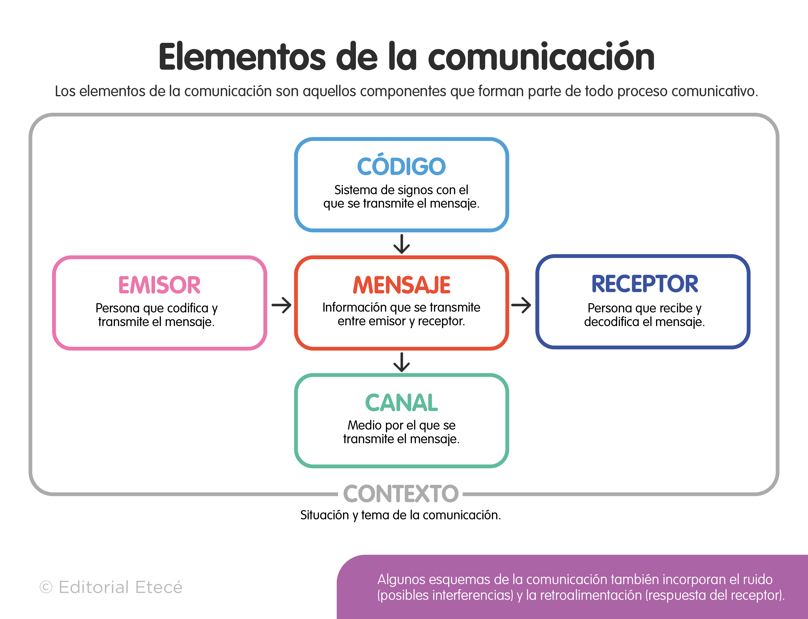

## {data-background-color="#00788d"}
:::: {.columns .v-center-container}
::: {.column width=20%}
{width="80%" fig-align="right"} <br>

:::
::: {.column width=80%}

# [Nociones básicas de programación en]{.white} [R]{.purple} <br> [*Lenguaje* <br> *Codificación* <br> *Recodificación*]{.black} 

------------------------------------------------------------------------
<br>
Equipo docente Estadística Descriptiva 
:::
::::

# [**Lenguaje R**]{.white}{data-background-color="#bc3c6f"}

## [[R]{.purple} es un lenguaje de programación]{.black} 

Un lenguaje de programación es un:

- *Sistema estructurado compuesto por **reglas, símbolos y una sintaxis específica** que permite escribir **instrucciones** comprensibles para una computadora*.

Esas **instrucciones** son lo que conocemos como [**código**]{.purple}. El código le indica a la computadora ***qué* debe hacer y *cómo* debe hacerlo** de manera precisa.

> En otras palabras, el **lenguaje de programación** funciona como un **intermediario** entre el pensamiento humano y el lenguaje binario que entiende la computadora.


## 


## [En nuestro contexto]{.black} 

> El *emisor* somos **nosotros.**

> El *receptor* es la **computadora.**

> El *canal* será la *interfaz* donde escribimos nuestras instrucciones, en este caso **RStudio.**

> Y el *código* será **R.** 

## [Gramática de R: *Lenguaje orientado a **objetos***]{.black}

<br>

```{r}
#| eval: false
#| echo: true

# idea base
objeto <- contenido


```

<br> 

```{r}
#| eval: false
#| echo: true


# ejemplo
edad <- 21
```


## [Gramática de R: *Lenguaje orientado a **objetos***]{.black}

<br> 

```{r}
#| eval: false
#| echo: true

# en términos gramáticales
objeto <- verbo(contenido)


```

<br> 

```{r}
#| eval: false
#| echo: true

# en términos matemáticos
objeto <- funcion(x)
```

<br> 

```{r}
#| eval: false
#| echo: true

# ejemplo
promedio <- mean(edades)

```


## [Gramática de R: ***Operadores***]{.black}


**Asignacion**: *asignan valores a variables*

- `<-`

**Misceláneos**: *usados para proósitos específicos como crear secuencias, acceder a elementos de datos o verificar pertenencia*

- `$`
- `%in%`
- `:`


## [Gramática de R: ***Operadores***]{.black}

**Relacionales**: *usados para hacer comparaciones*

- `==`
- `=!`
- `<`
- `>`

**Aritméicos**: *realizan operaciones aritméticas*

- `+`
- `*`
- `-`
- `/`


# [**Codificación**]{.white}{data-background-color="#bc3c6f"}

## [Acción de ***codificar***]{.black}

>**Codificar** es la acción de *escribir instrucciones* en nuestro lenguaje de programación. Es decir, escribir mensajes en R para indicarle a la computadora *qué* queremos hacer.

## [Elementos de la gramática del lenguaje R]{.black}

- **Objetos**: espacio donde almacenamos información. Puede contener números, palabras, variables o incluso bases de datos completas.

exisen varios ipos de objeos, nos imporan dos:  
 
- **Vectores**: 
- **Elementos**
- **Data frames**

## [**Objetos**]{.black} 

```{r}
#| eval: false
#| echo: true

edad <- 21

nombre <- "Rodrigo"

```


## [Tipo de objeto: `data.frame`]{.black}

| id | sexo   | edad |
| -- | ------ | ---- |
| 1  | Mujer  | 20   |
| 2  | Hombre | 25   |


## [En Ciencias Sociales...]{.black}

> Los *vectores* son las **columnas.**

> Los *elementos* son los valores individuales dentro de esas columnas (**filas**).

>Y el *data frame* es la **base de datos completa**.


A partir de estos datos, una de las tareas más comunes en análisis de datos es la **recodificación.**

# [**Recodificación**]{.white}{data-background-color="#bc3c6f"}

## [Acción de ***recodificar***]{.black}

>**Recodificar** significa *modificar la codificación original de una variable*. Es decir, transformar *cómo* están organizadas o clasificadas sus **categorías.**

***¿Para qué hacemos esto?***

Principalmente para que la información sea más *manejable*, más *clara* o más *interpretable* durante el análisis.

## [Ejemplo]{.black}

Tenemos: 

- 1 = menos de 100 mil
- 2 = entre 100 y 200 mil
- 3 = entre 200 y 300 mil
- 4 = más de 300 mil


Podríamos agruparlas en algo más *simple*:

- 1 = ingresos bajos
- 2 = ingresos altos


## [Objetivo de recodificar]{.black}

En general, recodificamos para:

- *Agrupar* categorías.
- *Simplificar* información.
- *Identificar* valores perdidos o NA.
- *Facilitar* el análisis estadístico

Sin embargo, esto tiene un *costo*: **pérdida de información**.


Por eso recodificar siempre implica *tomar decisiones analíticas*.


## [**NA's**]{.black}

>Representa casos donde *no existe información disponible* para una variable.

Por ejemplo:

- una persona no respondió una pregunta,
- la respuesta fue inválida,
- o el dato se perdió durante el regisro 

## [En términos *operativos*...]{.black}

Las recodificaciones pueden hacerse de dos maneras.

1. Modificando *directamente* una variable ya existente. Es decir, *sobreescribiendo el objeto*.

2. Crear una *nueva variable* utilizando información de variables existentes.

## [En términos *teóricos*...]{.black}

Estas transformaciones *no son arbitrarias*. Tienen una base teórica relacionada con los [**niveles de medición.**]{.purple}

Los niveles de medición indican qué tipo de operaciones podemos realizar con una variable.

Por ejemplo:

Variables nominales: categorías sin orden, como sexo o nacionalidad.
Variables ordinales: categorías con orden, como nivel educativo.
Variables cuantitativas: variables numéricas, como edad o ingreso.

Debido a estas propiedades, generalmente podemos simplificar variables cuantitativas hacia categorías cualitativas, pero no siempre podemos hacer el proceso inverso sin perder sentido teórico o información válida.

## [Consideraciones importantes al momento de recodificar]{.black}

Primero, debemos observar los valores NA.

Si una variable tiene demasiados datos perdidos —por ejemplo más del 10%— debemos ser cuidadosos, porque podríamos estar trabajando con información incompleta.

Segundo, debemos revisar la distribución de las categorías.

Si al recodificar aparece un sesgo muy fuerte o la distribución cambia demasiado en cada transformación, puede ser señal de que la recodificación no es adecuada.

Por eso, recodificar no es solamente una decisión técnica. También es una decisión teórica y metodológica que afecta cómo interpretamos la realidad social a partir de los datos.

## [1) Entendimos que [R es un **lenguaje**]{.purple} <br> 2) Para transmitirlo debemos [**codificar**]{.purple} <br> 3) Cuando nos enfrentamos a un `data.frame` podemos [**recodificar**]{.purple}]{.black} <br> <br> [Próxima cápsula: *flujo de trabajo con interfaz RStudio*]{.white}{data-background-color="#00788d"}


