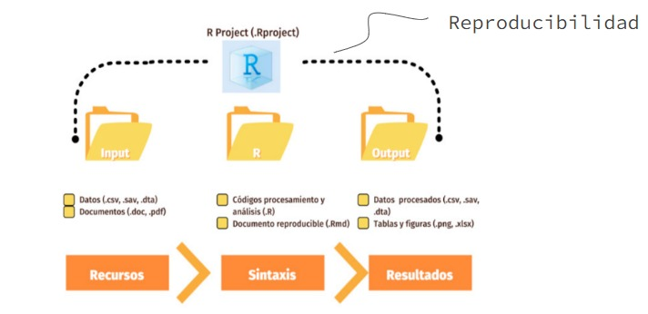
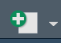
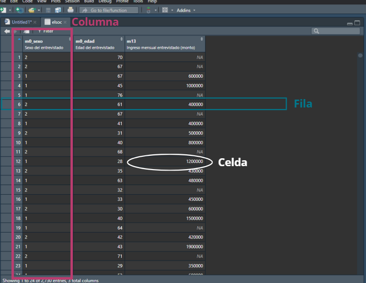

## {data-background-color="#00788d"}
:::: {.columns .v-center-container}
::: {.column width=20%}
{width="80%" fig-align="right"} <br>

:::
::: {.column width=80%}

# [Repaso primera sesión de [R]{.purple}]{.white} 

------------------------------------------------------------------------
<br>
Equipo docente Estadística Descriptiva 
:::
::::

## [**¿Qué vimos en la sesión anterior**]{.white}{data-background-color="#00788d"}

- [Diferencia entre <span style="background:#bc3c6f">**R** y **RStudio**</span>]{.black}
- [Flujo de trabajo en R: <span style="background:#bc3c6f">**IPO**</span>]{.black}
- [Proyecto de R <span style="background:#bc3c6f">(`.Rproject`)</span>]{.black}
- [Script <span style="background:#bc3c6f">(`.R`)</span>]{.black}
- [Estructura de datos y su funcionamiento en R: <span style="background:#bc3c6f">**filas, columnas, celdas y matrices**</span>]{.black}


# [**R** y **RStudio**]{.white}{data-background-color="#bc3c6f"}

##

:::{.columns}
::: {.column width=40%}
::: {.callout-note title="R" icon=false}

Lenguaje de programación 


:::
:::

::: {.column width=10%}
:::

::: {.column width=40%}
::: {.callout-caution title="RStudio" icon=false}
Interfaz de R


:::
:::
:::

# [**IPO**]{.white}{data-background-color="#bc3c6f"}

## [Flujo de trabajo: mediante **orden de carpetas**]{.black}




# [`.Rproject`]{.white}{data-background-color="#bc3c6f"}

## [**Proyecto de R**]{.black}

::: {.callout-note title="En el computador" icon=false}

*Es la carpeta general que contiene las subcarpetas de IPO*

:::

::: {.callout-note title="En Rstudio" icon=false}
*Carpeta autocontenida identificado por un arhico `.Rproj`* 

:::

::: {.callout-note title="En términos simples para este curso" icon=false}
 *Es la sesión específica de trabajo que generamos en Rstudio*   

:::

# [Archivo `.R`]{.white}{data-background-color="#bc3c6f"}

##



::: {.callout-note title="Definición" icon=false}

***Documento** u **hoja** en donde escribiremos y guardaremos nuestro **código**, y en donde a la vez podremos ir ordenando nuestros pasos e incluso ir comentándolos. Cuando hablamos de Sintaxis estamos refiriéndonos, en escencia, a un Script.* 

- Para comentar usamos "**#**" antes de nuestra frase:

```{r}
#| eval: false
#| echo: true

# Así se ve un comentario 

Así_se_ve_el_código 
```

Para ordenar nuestro script:
```{r}
#| eval: false
#| echo: true

# 1. Cargar librerías

pacman::p_load(tidyverse, # colección de paquetes para manipulación de datos
               dplyr, # para manipular datos
               haven, # para importar datos
               car # para recodificar datos
               )


```


:::


# [**Filas, columnas, celdas y matrices**]{.white}{data-background-color="#bc3c6f"}

## [**Matriz o Base de datos**]{.black}

